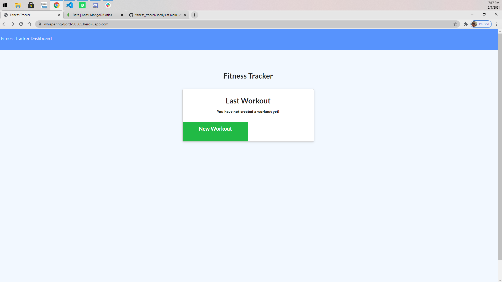

# HW17-FitnessTracker

This application is a simple workout tracker a user can view, create, and track their daily workouts. The user can manually log multiple exercises at a time, and the exercises are categorized as cardio or resistance. For cardio, the user can track their distance in miles and the duration of the exercise. For resistance, the user can track how much weight they are lifting, the amount of sets, the amount of reps within each set, and the duration of the exercise. 
##
This application uses MongoDB, mongoose, express, and node.

# User Story

Thanks to your New Year's Resolution or maybe your significant other wants to start a healthy way of life?! This app will help you be on your way to become a new you. :cry: (Sorry)

## https://whispering-fjord-90565.herokuapp.com/

###

# Enjoy :happy:
